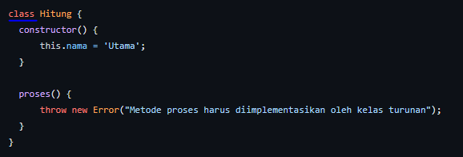
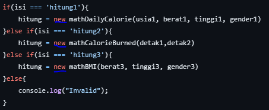

Nilai Matkul
UAS

1. implementasai student group (50%)
2. Interview mengenai OOP di projectnya

Laporan - PDF - masing2
Implenetasi OOP - boleh sama

1. Class & Object

- Implentasi : Penciptaan class hitung

- Implementasi : instansiasi object, kedalam variable hitung yang dimana hal ini memungkinkan var hitung dapat mengakses object yang terdapat dalam class :
  - mathDailyCalorie
  - mathCalorieBurned
  - mathBMI

2. encapsulation
